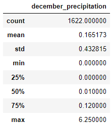

# surfs_up

## Overview of Project
I'm looking to start my own ice cream and surf shop in Oahu, Hawaii. Unfortunately, I don't have the money to fund the venture myself. Instead, I'm relying on financial assistance from an investor named W. Avy. In order to get my investor to fully commit to my business, I need to provide him with data on the weather in Oahu. The demand for both ice cream and surfing are extremely weather dependent. The business could quickly go under if we get too many cold days during the year.

## Results
In order to gauge what the weather will be like in Oahu for my shop, I need to understand what to expect year-round. I chose to do an analysis on the months of June and December because then I can see what the temperature is at the end/start of the year and halfway through the year. Also, in Hawaii summer is between May and October. Meanwhile, winter is between October and April. Fun fact, Hawaii doesn't have spring or fall. It's either summer or it's winter.

# Three major take aways:

* It's fair to say that if you're going to get into the water for surfing, you're going to want the temperature of the weather to be in the 70s at least. Given our data, we can see that even in only the 25th percentile, the weather in June is in the 70s! That's a good sign! June is the second month of what is considered Hawaii's summer. So, the shop would be off to a good start for the summer season.
* As a month, December is right in the middle of winter in Hawaii. So, this should be one of the coldest months of the year. Surprisingly enough, the 50th percentile of the data shows that the weather creeps into the 70s. So, the business will probably be slower half the time. Therefore, I'm going to have to budget those months more appropriately.
* It's REALLY good to see that in the month of December, there are days that can reach 83 degrees. In June, the high is 85. So that's close to one another! I believe that those exceptionally nice days will help make up for the slower/colder days. People show up and get out when they've been stuck inside for a while because of cold weather.

## Summary:

I believe that it would be a sound investment to open an ice cream and surf shop in Oahu. The temperature is appropriate for the sport even during the winter months. The business is going to have to be mindful of the winter months because it's going to be noticeably slower than the summer. This might mean cutting hours, cutting days, having less staff, or even offering less services. Small businesses are almost always slower during the winter. It's completely doable if the business is still able to operate.

# Two additional queries:
Having a query for precipitation for June and another one for December is useful information. Rain can impact people's willingness to go get ice cream or go surfing. Surprisingly there wasn't much rainfall or either month. There were some outliers with the data. Both months can have heavy rainfall, but in general there really isn't that much. Which is good news!

